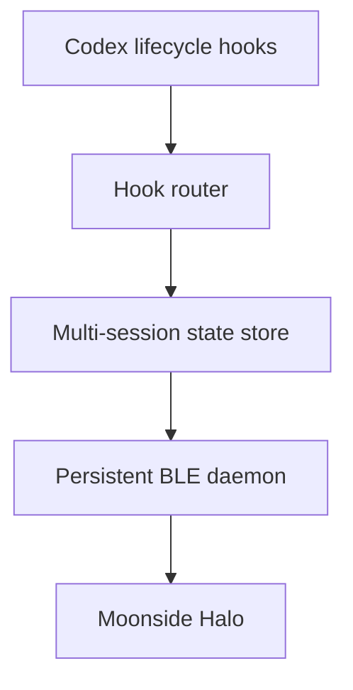

# Codex Lamp Design Specification

Date: 2026-08-11

## 1. Purpose and scope

Build a macOS Codex plugin that drives a Moonside Halo lamp from Codex lifecycle events. The result must work for the owner's local Codex App and CLI sessions and be structured as an open-source Codex Marketplace repository that other users can install.

The first release supports macOS, Python 3.10 or newer, Codex App or CLI, and Moonside Halo over Bluetooth Low Energy. Other operating systems and lamp brands are outside the first-release scope.

The implementation derives the Moonside BLE protocol and persistent-connection pattern from [bobek-balinek/claude-lamp](https://github.com/bobek-balinek/claude-lamp), which is MIT licensed. The new implementation replaces Claude-specific hooks with Codex-native hooks and adds multi-session aggregation, diagnostics, packaging, and automated tests.

## 2. User-visible behavior

| Effective state | Trigger | Halo output |
| --- | --- | --- |
| `working` | A user submits a prompt or Codex invokes a supported local tool | `BEAT2` theme using white and navy |
| `input` | Codex requests permission or its completed response clearly requests user input | Solid purple, RGB `(200, 0, 255)` |
| `idle` | A session starts or Codex completes a response that does not request input | Solid sunset mango, RGB `(255, 180, 50)` |
| `off` | No active sessions remain or every session has expired | LEDs off |

When multiple sessions exist, the effective-state priority is `input > working > idle > off`. This ensures that a request for user action is never hidden by background activity.

The `Stop` hook uses the stable `last_assistant_message` field to recognize explicit user-input requests. Recognition is conservative and covers terminal question marks plus a small configurable set of Chinese and English phrases such as “请确认”, “请选择”, “please confirm”, “would you like”, and “let me know”. If classification is uncertain, the state becomes `idle`.

Each session expires after 30 minutes without a new event by default. Expired states are removed before aggregation. If no active state remains, the lamp turns off.

## 3. Architecture



### 3.1 Hook router

Read one Codex hook JSON object from standard input, map the event to a state, atomically update that session's record, and ensure the daemon is running. Keep this path independent of BLE I/O so a hook never waits for device discovery or connection.

Handle these Codex events:

- `SessionStart` → `idle`
- `UserPromptSubmit` → `working`
- `PreToolUse` → `working`
- `PermissionRequest` → `input`
- `Stop` → `input` when the final response explicitly requests user action, otherwise `idle`
- `SessionEnd` → remove the session record

Always exit successfully after recording a diagnostic message on failure. Lamp failures must never block or modify Codex behavior.

### 3.2 Multi-session state store

Store one JSON record per Codex session. Each record contains the session identifier, state, event timestamp, and last update time. Use temporary-file replacement for atomic writes and a file lock for aggregation and cleanup.

Ignore out-of-order events that are older than the currently stored event. Recompute the effective state whenever a record changes or stale sessions are removed.

### 3.3 Moonside protocol adapter

Isolate device discovery and Nordic UART Service command generation from daemon lifecycle code. Support:

- automatic discovery by the `MOONSIDE` name prefix;
- optional selection by macOS CoreBluetooth UUID;
- `LEDON` and `LEDOFF`;
- `COLORRRRGGGBBB`;
- `BRIGHBBB`;
- `THEME.NAME.R,G,B,...`;
- raw command output for diagnostics.

### 3.4 Persistent BLE daemon

Run at most one daemon per user by using a non-blocking process lock. Maintain the BLE connection, watch the effective-state file, and send a command only when the effective state changes.

Reconnect with bounded exponential backoff after discovery, connection, or write failures. After reconnecting, reapply the current desired state. Shut down and turn the lamp off when no active sessions remain for the configured idle timeout or when the process receives a termination signal.

## 4. Local data and configuration

Use `~/Library/Application Support/CodexLamp/` as the default writable root. Allow tests and advanced users to override it with `CODEX_LAMP_HOME`.

Store the following beneath that directory:

- a dedicated Python virtual environment containing `bleak`;
- `config.json`;
- per-session state records and the effective-state record;
- daemon PID and lock files;
- rotating diagnostic logs.

Configuration supports the device name prefix or UUID, state colors and theme, brightness, stale-session timeout, question detection, and state priority. Create the configuration from bundled defaults on first setup and preserve user modifications during plugin upgrades.

## 5. Command-line interface

Install a `codex-lamp` command with these subcommands:

- `setup`: create or refresh the isolated runtime and default configuration;
- `scan`: discover compatible Moonside devices;
- `test`: display `idle`, `working`, `input`, and `off` in sequence;
- `test --dry-run`: print the BLE commands without accessing Bluetooth;
- `status`: show daemon, device, session, and effective-state information;
- `config`: read or update supported configuration values;
- `doctor`: check Python, `bleak`, macOS Bluetooth access, device discovery, plugin hooks, and runtime health;
- `logs`: show the diagnostic log path and recent entries;
- `uninstall`: stop the daemon, turn the lamp off when possible, and remove Codex Lamp local runtime data.

The `uninstall` subcommand does not mutate Codex's plugin registry. Users remove or disable the plugin through Codex's plugin controls.

## 6. Plugin and repository packaging

Use this repository structure:

```text
codex-lamp/
├── .agents/plugins/marketplace.json
├── plugins/codex-lamp/
│   ├── .codex-plugin/plugin.json
│   ├── hooks/hooks.json
│   ├── scripts/
│   ├── skills/codex-lamp/SKILL.md
│   └── assets/
├── tests/
├── install.sh
├── README.md
├── README.zh-CN.md
├── LICENSE
└── THIRD_PARTY_NOTICES.md
```

The plugin manifest identifies `codex-lamp`, declares the bundled skill and lifecycle hooks, and contains install-surface metadata. The default hook file is `hooks/hooks.json`, and every command resolves code from `${PLUGIN_ROOT}`.

The repository-level Marketplace entry enables installation with `codex plugin marketplace add` followed by the published GitHub repository URL. The GitHub owner is supplied only when the completed local project is published; it is not embedded in runtime code or tests.

### 6.1 Local installation

Running `./install.sh` must:

1. verify macOS, Python 3.10 or newer, and Codex CLI;
2. create the isolated Python runtime and install `bleak`;
3. add the checked-out repository as a local Codex Marketplace;
4. install the `codex-lamp` command;
5. run non-destructive diagnostics and offer the four-state lamp test;
6. instruct the user to install the plugin and review its hooks in Codex.

Plugin installation and hook trust remain explicit user actions. The installer must not bypass Codex's trust review.

### 6.2 Open-source installation

After publication, users add the GitHub repository as a Marketplace, install Codex Lamp from Codex App or CLI, run `codex-lamp setup`, review and trust hooks with `/hooks`, then run `codex-lamp doctor` and `codex-lamp test`.

Preserve the upstream MIT license notice and attribution in `THIRD_PARTY_NOTICES.md`. License new project code under MIT.

## 7. Failure handling

- Keep hook execution independent from BLE operations and target a normal execution time below 100 ms.
- Return success from hook handlers even when runtime dependencies, Bluetooth permission, or the lamp are unavailable.
- Log actionable messages without repeatedly surfacing errors inside Codex.
- Apply a relaunch cooldown when the daemon repeatedly fails, preventing process storms.
- Reconnect automatically and restore the latest effective state after transient BLE failures.
- Preserve user configuration across setup and Marketplace upgrades.
- Avoid overwriting existing user-level Codex hooks or configuration; all lifecycle hooks are plugin-scoped.

## 8. Testing strategy

### 8.1 Automated tests

Test the following without hardware:

- Codex event-to-state mapping;
- Chinese and English question classification;
- multi-session priority and stale-session cleanup;
- atomic writes and out-of-order event rejection;
- Moonside command formatting and range validation;
- daemon single-instance locking;
- mocked discovery, connection, command sequencing, disconnect, and retry behavior;
- `test --dry-run` output;
- plugin manifest, Marketplace, hooks JSON, skill, and installer structure.

### 8.2 Hardware acceptance

On the owner's macOS machine with a Moonside Halo:

1. discover and connect to the lamp;
2. display `idle → working → input → off` correctly;
3. enter `working` after prompt submission and during local tool use;
4. enter `input` for permission prompts and explicit questions;
5. return to `idle` after ordinary completion;
6. turn off after all sessions end;
7. preserve correct priority across two concurrent Codex sessions;
8. reconnect and restore state after the lamp is power-cycled.

## 9. Acceptance criteria

- All automated tests pass on a non-Bluetooth development environment.
- Hook handlers normally complete in less than 100 ms and never wait for BLE.
- Once connected, state-to-lamp latency is below 500 ms under normal local conditions.
- Missing permissions, dependencies, or hardware never interrupt Codex.
- Local installation, upgrade, diagnostics, and cleanup do not overwrite existing Codex configuration.
- The repository is installable as a local Marketplace and ready for GitHub publication.
- Final hardware acceptance is completed with `codex-lamp doctor` and `codex-lamp test` on the owner's Mac.

## 10. Authoritative references

- Original project: <https://github.com/bobek-balinek/claude-lamp>
- Codex hooks: <https://developers.openai.com/codex/hooks>
- Codex skills: <https://developers.openai.com/codex/build-skills>
- Codex plugin packaging and Marketplace: <https://developers.openai.com/plugins/build/plugins>
